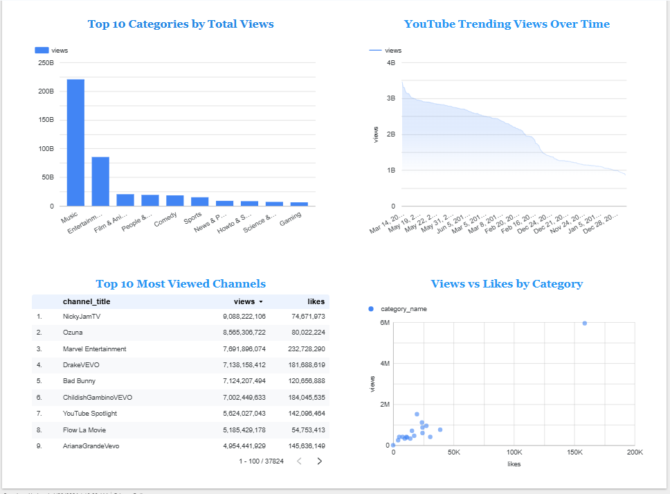

# 🎬 YouTube Trending Videos — End-to-End Data Engineering Project


> A complete, cloud-based data engineering pipeline built entirely with **free tools** — no AWS account required.  
> Inspired by [Darshil Parmar's](https://www.youtube.com/@DarshilParmar) YouTube Data Engineering tutorial.

---

## 📸 Dashboard Preview



---

## 📌 Project Overview

This project demonstrates a full **end-to-end data engineering pipeline** that ingests, cleans, transforms, stores, and visualizes YouTube trending video data from **10 countries** (CA, DE, FR, GB, IN, JP, KR, MX, RU, US).

Instead of paid AWS services, this project uses **100% free cloud alternatives** — making it accessible to anyone.

---

## 🏗️ Architecture

```
📦 Raw Data (CSV + JSON — Kaggle Dataset)
            │
            ▼
🔗 Google Drive ──────────────── Storage Layer (replaces AWS S3)
            │
            ▼
🧹 Google Colab + Pandas ──────── ETL Layer (replaces AWS Glue)
   • Load CSV & JSON files
   • Clean & transform data
   • Merge category names
            │
            ▼
🗄️ Neon PostgreSQL ────────────── Warehouse Layer (replaces AWS Redshift)
   • Store 339,515 rows
   • Query with SQL
            │
            ▼
📊 Looker Studio ──────────────── Visualization Layer (replaces AWS QuickSight)
   • Interactive Dashboard
   • 4 Chart Types
```

---

## 🛠️ Tech Stack

| Layer | AWS Service | Free Alternative |
|-------|-------------|-----------------|
| Storage | S3 | Google Drive |
| ETL | AWS Glue | Google Colab + Pandas |
| Query | Athena | SQLAlchemy + SQL |
| Warehouse | Redshift | Neon PostgreSQL |
| Orchestration | Lambda | Python Scripts |
| Visualization | QuickSight | Looker Studio |

---

## 📂 Dataset

- **Source:** [Kaggle — YouTube Trending Videos Dataset](https://www.kaggle.com/datasets/datasnaek/youtube-new)
- **Countries:** CA, DE, FR, GB, IN, JP, KR, MX, RU, US
- **Files:** 10 CSV files + 10 JSON category files
- **Total Size:** ~539 MB
- **Raw Rows:** 375,942 → Cleaned: 339,515

---

## 📁 Repository Structure

```
youtube-data-engineering/
│
├── 📓 youtube_de_pipeline.ipynb   ← Main Colab Notebook (full pipeline)
├── 📄 README.md                   ← You are here
├── 📄 requirements.txt            ← Python dependencies
│
├── 📁 dashboard/
│   └── 🖼️ dashboard_screenshot.png  ← Looker Studio Dashboard
│
└── 📁 data_sample/
    └── sample_data.csv            ← 100-row sample of cleaned data
```

---

## ⚙️ How to Run This Project

### Prerequisites
- Google Account (for Colab + Drive)
- [Neon.tech](https://neon.tech) free account
- [Looker Studio](https://lookerstudio.google.com) (free with Google account)
- Dataset downloaded from [Kaggle](https://www.kaggle.com/datasets/datasnaek/youtube-new)

### Step 1 — Upload Data to Google Drive
Upload the full dataset folder to your Google Drive.

### Step 2 — Open Notebook in Google Colab
[](https://colab.research.google.com/)

```bash
# Install dependencies
pip install pandas psycopg2-binary sqlalchemy
```

### Step 3 — Configure Neon PostgreSQL
Create a free database at [neon.tech](https://neon.tech) and update the connection details in the notebook:

```python
host = "your-neon-host.eu-central-1.aws.neon.tech"
database = "neondb"
user = "neondb_owner"
password = "your_password"
```

### Step 4 — Run the Pipeline
Run all cells in `youtube_de_pipeline.ipynb` — the pipeline will:
1. Load and explore raw data
2. Clean and transform data
3. Merge category names from JSON files
4. Load 339,515 rows into Neon PostgreSQL
5. Run SQL analysis queries

### Step 5 — Connect Looker Studio
1. Go to [lookerstudio.google.com](https://lookerstudio.google.com)
2. Create a new report → Select **PostgreSQL** connector
3. Download SSL certificate: [isrgrootx1.pem](https://letsencrypt.org/certs/isrgrootx1.pem)
4. Fill in your Neon connection details with SSL enabled
5. Use Custom Query to load data and build charts

---

## 💡 Key Insights

| Insight | Finding |
|---------|---------|
| 🎵 Most Viewed Category | **Music** dominates globally |
| ❤️ Highest Engagement | **Nonprofits & Activism** and **Comedy** have the best like rates |
| 📅 Best Trending Days | Videos trend most on **Saturday** and **Tuesday** |
| 👑 Top Channel | **NickyJamTV** with 9+ Billion views |

---

## 📊 Dashboard Charts

| Chart | Type | Description |
|-------|------|-------------|
| Top Categories by Views | Bar Chart | Which categories get the most views |
| Views Over Time | Line Chart | How trending views change over time |
| Top 10 Channels | Table | Most viewed channels in the dataset |
| Views vs Likes | Scatter Chart | Correlation between views and likes |

---

## 🙏 Credits

- Project concept by **[Darshil Parmar](https://www.youtube.com/@DarshilParmar)**
- Dataset from **[Kaggle](https://www.kaggle.com/datasets/datasnaek/youtube-new)**
- Free infrastructure: **Google Colab · Neon.tech · Looker Studio**

---

## 📬 Connect With Me

[](https://linkedin.com/in/your-profile)
[](https://github.com/your-username)
